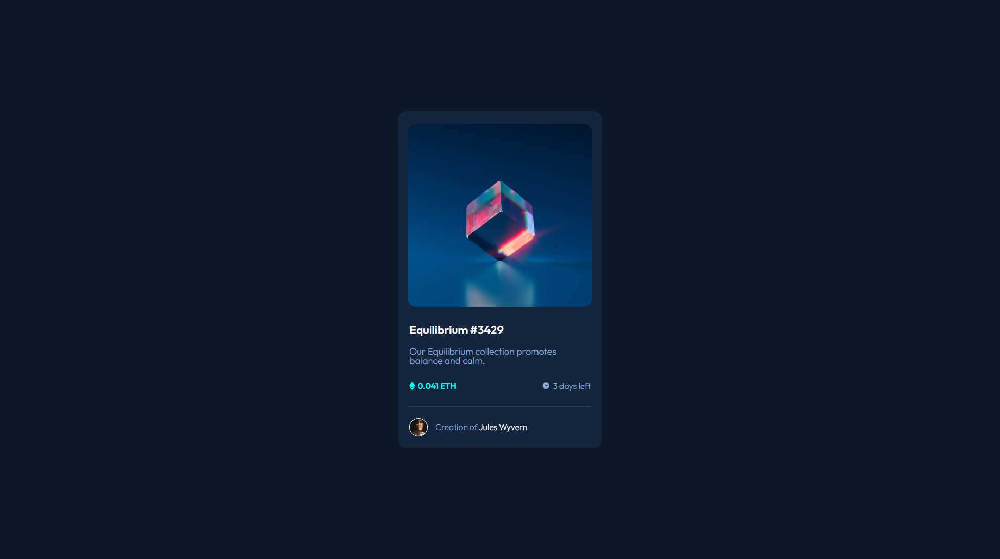

# Frontend Mentor - NFT preview card component solution

This is a solution to the [NFT preview card component challenge on Frontend Mentor](https://www.frontendmentor.io/challenges/nft-preview-card-component-SbdUL_w0U). Frontend Mentor challenges help you improve your coding skills by building realistic projects. 

## Table of contents

- [Overview](#overview)
  - [Screenshot](#screenshot)
  - [Links](#links)
- [My process](#my-process)
  - [Built with](#built-with)
  - [What I learned](#what-i-learned)
  - [Continued development](#continued-development)
  - [Useful resources](#useful-resources)
- [Author](#author)

## Overview

### Screenshot



### Links

- Solution URL: [solution URL](https://github.com/Luka-khokhashvili/NFT_preview_card_component.git)
- Live Site URL: [live site URL](https://luka-khokhashvili.github.io/NFT_preview_card_component/)

## My process

### Built with

- Semantic HTML5 markup
- HTML5 classes
- CSS custom properties
- Flexbox
- :root color variables
- Mobile responsive design

### What I learned

I tested and acknowledged my skills in web-development, also found what i had problems with and worked to fix them. I mostly admire that i become better in building responsive designs and useing flexbox as a powerfull tool.

Those are code sections i am proud of doing

```html

```
```css
@media only screen and (max-width: 400px) {
  .main-container {
    width: 87.2%;
  }
}
```

### Continued development

I would love to and will focus on developing more skills and growing my knowledge in building better styled website, useing more fluent and stable css and smoother responsive design for every kind of device screens

### Useful resources

- [w3schools](https://www.w3schools.com/) - This website is a huge document of any coding languages. I used it to find usefull and neaded html tags and some css properties.
- [OpenAI ChatGPT](https://chat.openai.com/) - ChatGPT AI helped me fixing major bugs and some simple problems.

## Author

- GitHUb - [Luka khokhashvili](https://github.com/Luka-khokhashvili)
- Frontend Mentor - [@Hope](https://www.frontendmentor.io/profile/Hope-Web-Star)
- LinkedIn - [@luka-khokhashvili](https://www.linkedin.com/in/luka-khokhashvili-8179b7285/)